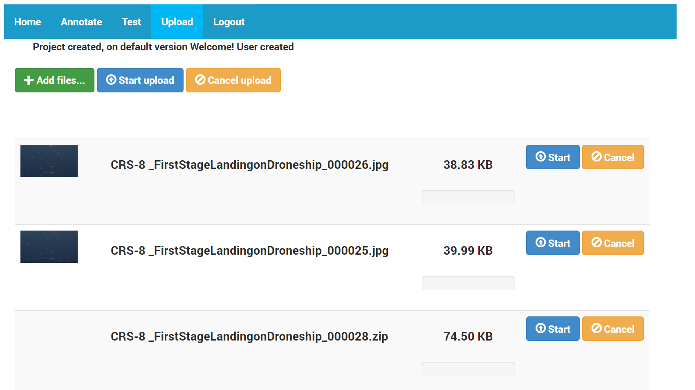
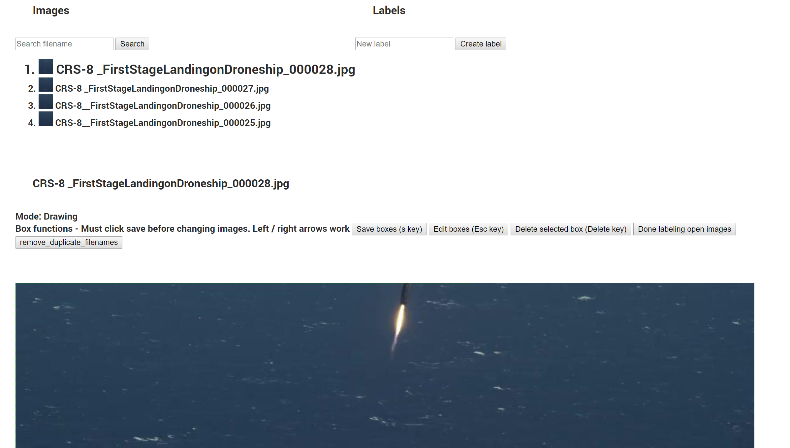
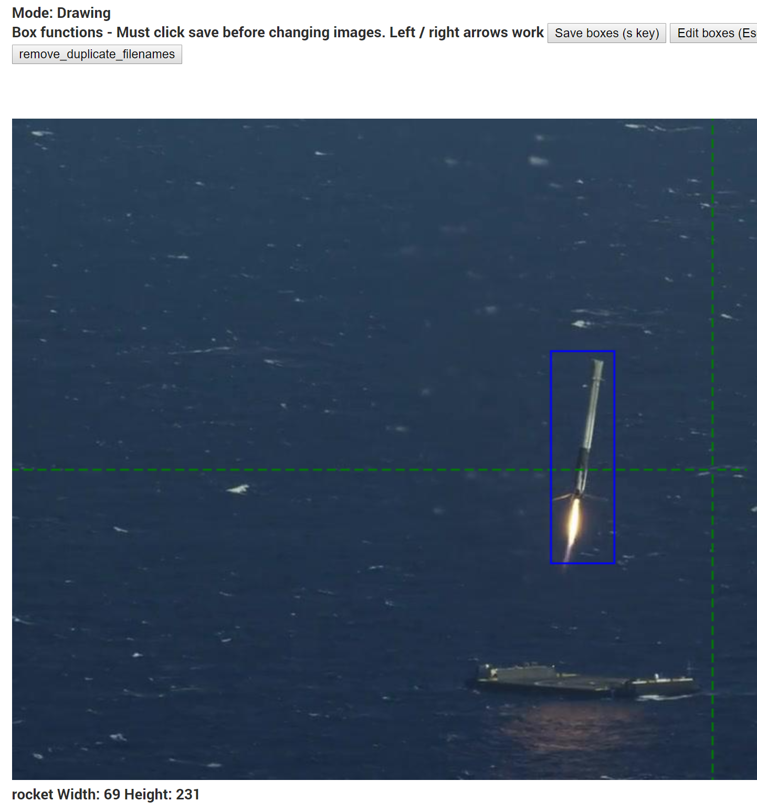
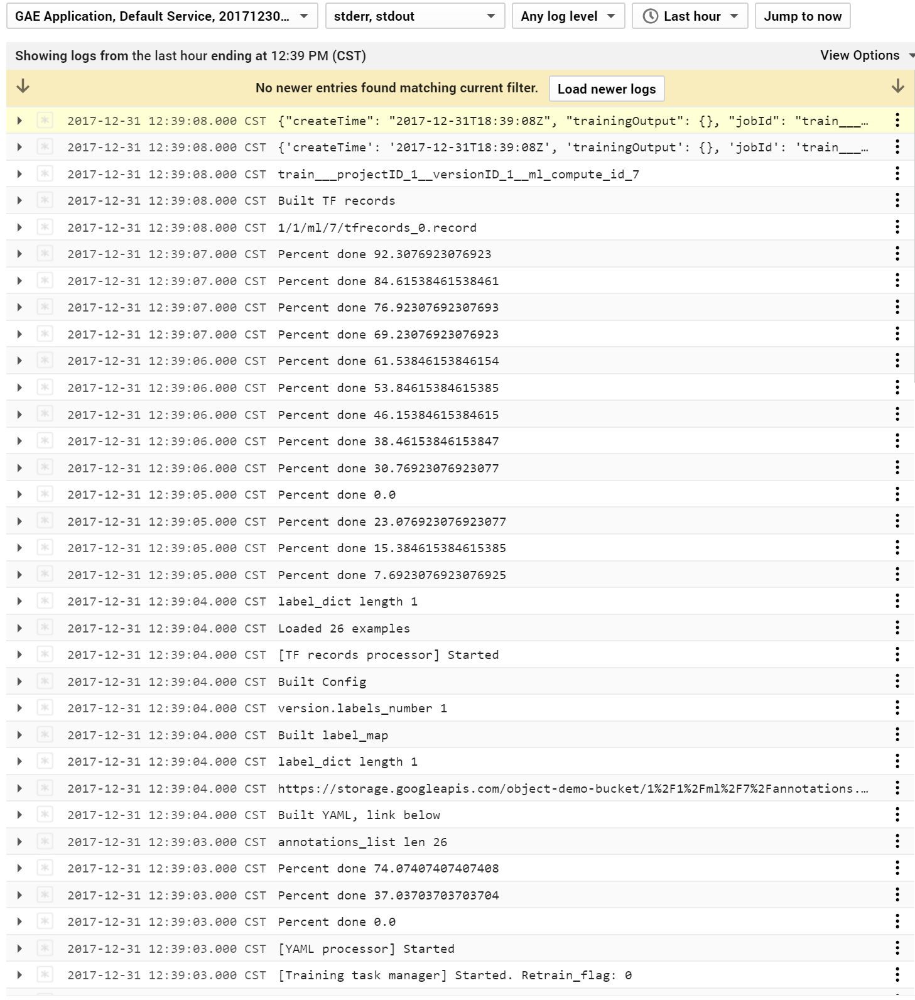
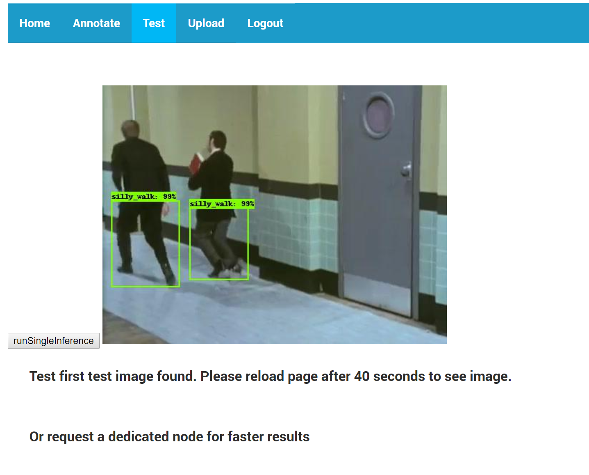
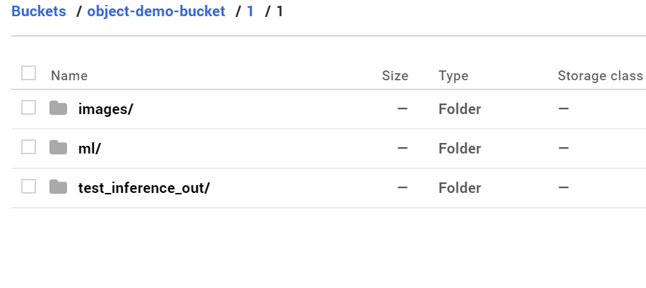
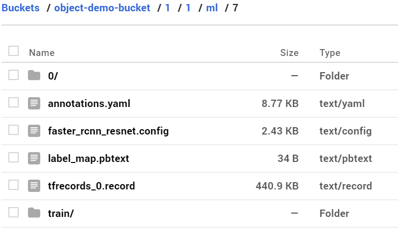
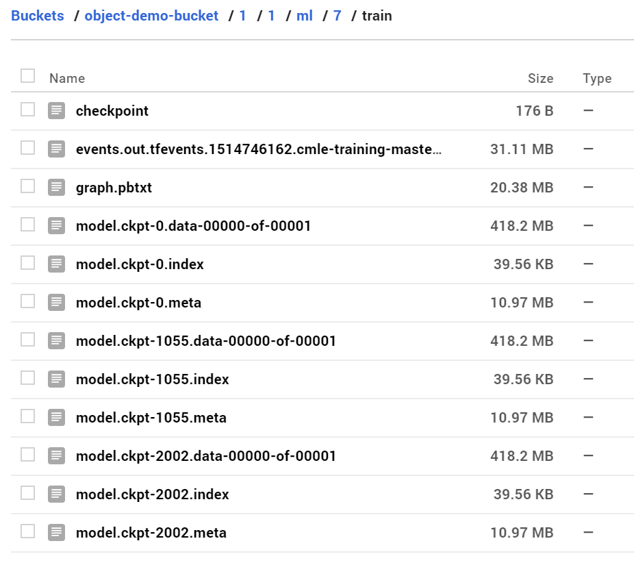

## App quick start

0. **Create user account**
	* This is a great point to insert a signup code, ie
		* pseudocode `if code == 'project': assign user to project.id `

1. **Upload images**

	* If `number_images > 5` suggest using zip file
	* Max of ~32 mb per zip file
	* Can upload multiple zip files
	* Files process in the background
		* Check the app engine logs for updates on file processing
	* Upload logic is in methods/storage/fileUpload.py
		* See there for choices on resizing over sized files for example
		* As this logic needs lot of work it's not yet moved to settings
	* During a test was able to process about 60,000 midsized images in about an hour. Your results will of course depend on on settings, hardware, and file sizes.
		* Contributions to improve upload logic welcome, for example would be interested in moving image processing to a dedicated pipeline like google data proc
	* Known bugs
		* Train count length is a little buggy sometimes, I think it's better to cache this value than requesting it each time but with current setup and multiple threads it gets messy quickly. Would also prefer if it only updated the count if the image processing was successful.
		* Was having some bugs with opening and closing sessions. Using scopped session seems pretty robust but I'm not sure if this is the optimal way to do it.

2. **Create labels**
	* Whichever label is selected is the one that will annotate with

3. **Annotate**

	* Drawing mode (Default)
		* Hold down left mouse button to start drawing 
		* Release left mouse button to stop drawing
	* Edit mode (Esc key to toggle between modes)
		* Move a box
			1. Click a box to select it
			2. Click and drag box to desired location to move it
			3. Release mouse
		* Delete a box
			1. Go to edit mode
			2. Select the box
			3. Hit delete key or delete button
	* Save boxes (s key) or click save boxes
		* By default boxes smaller than 5x5 pixels will be discarded
		* Boxes with invalid width / height will be discarded
		* Boxes will only be saved if save is pressed (this allows you to easily undo mistakes)
	* Change images
		* Click on the image OR
		* Use left and right arrows on keyboard
	* Other functions
		* Remove duplicate file names
		* Delete current image
		* Change to test image (images are train images by default)
	* Bugs
		* Must move mouse to show box selected in edit mode
		* On large images canvas is a bit buggy

		
4. **Done labelling open images**
	1. Basic: If you have a small number of images simply click this once and ignore advanced instructions.
	2. Advanced
		* This allows you to choose which images are used for training
		* Only images marked as: `done_labelling == True and soft_delete == False and train_image == True` will be used for building files.
		* Open images mean anything that is in the list of images in the UI
		* Use the search box to change the list of open images
			* Contributions to improve this welcome!

5. **Run training pipeline**
	1. Suggest having at least 10 images per class, ideally 100

6. **Download trained model and/or view single image on test page**
	1. project / version / ml / ml_version / train

